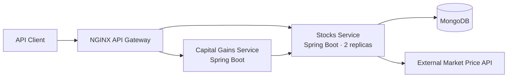

# Stock Portfolio Microservices Platform

A containerized stock-portfolio backend built with Java, Spring Boot, MongoDB, Docker, Kubernetes, and NGINX. The platform separates portfolio management from capital-gains analytics, connects the services through Kubernetes service discovery, and exposes a single API entry point through an NGINX gateway.

## Architecture



## What It Does

- Stores and manages stock holdings through RESTful CRUD endpoints.
- Retrieves current market prices from an external stock-price API.
- Calculates the value of individual holdings and the full portfolio.
- Calculates total capital gains, with optional filters based on share count.
- Routes all public requests through NGINX while keeping application services internal.
- Runs on Kubernetes with health probes, resource limits, persistent storage, and replicated stock-service instances.

## Services

| Component | Responsibility | Internal Port |
| --- | --- | --- |
| Stocks service | Stock CRUD, market-price lookup, holding value, and portfolio value | `8000` |
| Capital gains service | Aggregates gains across holdings and applies share-count filters | `8080` |
| MongoDB | Persists portfolio holdings | `27017` |
| NGINX | Routes external requests to the appropriate service | `80` |

## Technologies

- Java 17
- Spring Boot 3
- Spring Web and Spring Data MongoDB
- MongoDB
- Docker
- Kubernetes and Kind
- NGINX
- Maven
- JUnit 5

## API Reference

The examples below assume the gateway is forwarded to `http://localhost:8080`.

| Method | Endpoint | Description |
| --- | --- | --- |
| `POST` | `/stocks` | Add a holding |
| `GET` | `/stocks` | List all holdings |
| `GET` | `/stocks/{id}` | Retrieve one holding |
| `PUT` | `/stocks/{id}` | Update a holding |
| `DELETE` | `/stocks/{id}` | Delete a holding |
| `GET` | `/stock-value/{id}` | Get the current value of one holding |
| `GET` | `/portfolio-value` | Get the current portfolio value |
| `GET` | `/capital-gains` | Calculate total capital gains |

Capital gains can be filtered with `numsharesgt` and `numshareslt` query parameters:

```text
GET /capital-gains?numsharesgt=10&numshareslt=100
```

## Getting Started

### Prerequisites

- Java 17
- Docker
- Kind
- `kubectl`
- An API Ninjas stock-price API key

### 1. Configure the market-data credential

Set the API key in your shell. Do not commit it to the repository.

```bash
export NINJA_API_KEY="your-api-key"
```

For local development, MongoDB defaults to `mongodb://localhost:27017/stocks`. Override it when needed:

```bash
export MONGO_URI="mongodb://localhost:27017/stocks"
```

### 2. Create a local Kubernetes cluster

```bash
kind create cluster --name stocks-platform
kubectl apply -f namespace.yaml
```

Create the Kubernetes Secret consumed by the stocks service:

```bash
kubectl create secret generic stocks-api-secrets \
  --namespace stocks \
  --from-literal=ninja-api-key="$NINJA_API_KEY"
```

### 3. Build and load the service images

```bash
(cd stocks && ./mvnw clean package -DskipTests && docker build -t stocks:latest .)
(cd capitalgains && ./mvnw clean package -DskipTests && docker build -t capitalgains:latest .)

kind load docker-image stocks:latest --name stocks-platform
kind load docker-image capitalgains:latest --name stocks-platform
```

### 4. Deploy the platform

```bash
kubectl apply -f database/persistentVolume.yaml
kubectl apply -f database/persistentVolumeClaim.yaml
kubectl apply -f database/deployment.yaml
kubectl apply -f database/service.yaml

kubectl apply -f stocks/deployment.yaml
kubectl apply -f stocks/service.yaml

kubectl apply -f capitalgains/deployment.yaml
kubectl apply -f capitalgains/service.yaml

kubectl apply -f nginx/configmap.yaml
kubectl apply -f nginx/deployment.yaml
kubectl apply -f nginx/service.yaml
```

Check that every workload is ready:

```bash
kubectl get pods --namespace stocks
```

### 5. Access the API

```bash
kubectl port-forward --namespace stocks service/nginx-service 8080:80
```

The gateway is now available at `http://localhost:8080`.

## Example Usage

Add a stock holding:

```bash
curl -X POST http://localhost:8080/stocks \
  -H "Content-Type: application/json" \
  -d '{
    "name": "Apple",
    "symbol": "AAPL",
    "purchase price": 150.00,
    "purchase date": "01-01-2025",
    "shares": 10
  }'
```

List the portfolio:

```bash
curl http://localhost:8080/stocks
```

Calculate capital gains:

```bash
curl "http://localhost:8080/capital-gains?numsharesgt=5"
```

## Project Structure

```text
.
├── stocks/          # Portfolio CRUD and valuation service
├── capitalgains/    # Capital-gains aggregation service
├── database/        # MongoDB deployment and persistent storage
├── nginx/           # API gateway configuration and deployment
├── namespace.yaml   # Kubernetes namespace
└── build-and-load.sh
```

## Testing

Run the Spring Boot test suites independently:

```bash
(cd stocks && ./mvnw test)
(cd capitalgains && ./mvnw test)
```

## Design Highlights

- Clear service boundaries between portfolio operations and financial analytics.
- Synchronous service-to-service REST communication using Kubernetes DNS.
- Atomic MongoDB updates and deletes through `MongoTemplate`.
- Horizontal replication of the stocks service behind a Kubernetes `ClusterIP` service.
- Readiness and liveness probes for stock-service instances.
- Persistent MongoDB storage through a `PersistentVolumeClaim`.
- Centralized routing through an NGINX gateway.

## Current Scope

This project is designed as a local microservices and Kubernetes demonstration. Production hardening would include authentication, TLS, comprehensive automated tests, decimal-based monetary calculations, managed database storage, and observability.

## Project Origin

This project originated as collaborative cloud-computing coursework by Idan Lipschitz and Shahar Shvili. It is presented here as a practical demonstration of Java backend development, service decomposition, containerization, and Kubernetes orchestration.
